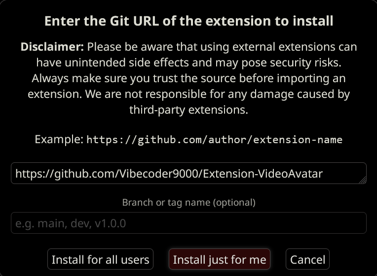

indev, may or may not work. currently bugfixing. Requirement: newest staging 13.4, post https://github.com/SillyTavern/SillyTavern/commit/b7f93b3594c9a6bb2d3c09597ad3c160ede46b1a

---

# Video Avatars Extension for SillyTavern

Bring your characters to life with animated avatars!

---

## Usage

1. Click the character avatar.
2. Upload a `.webm` or `.mp4` file.
3. The extension will automatically:
   - Generate a PNG thumbnail for the character card
   - Convert the video to animated WebP
   - Save the PNG to `data/<user>/characters/`
   - Save the animated WEBP to `data/<userName>/user/images/<character_name>/<filename>.webp` where `<character_name>` is the character's name and `<filename>` is the PNG filename.
   - Display the animated avatar when viewing the character

Video upload requires the [Video Background Loader extension](https://github.com/SillyTavern/Extension-VideoBackgroundLoader). Without it, you'll see a notification prompting you to install it.

---

### Installation

1. Copy this page's URL: `https://github.com/Vibecoder9000/Extension-VideoAvatar`
2. Click on the `Extensions` tab:

3. Click `Install extension`:

4. Paste this page's URL and click `Install just for me`:

---

## Supported Avatar Types:

 - Character Avatars

## Unsupported Avatar Types:

 - Persona Avatars

 - I'm not planning to add persona avatars because I don't personally need/want them. Contact me if you would like them.

---

## Support

- **Issues:** [GitHub Issues](https://github.com/Vibecoder9000/Extension-VideoAvatar/issues)
- **Discussions:** [SillyTavern Discord](https://discord.gg/sillytavern)
- **DM:** URL `discord://-/users/643561434457833492` or Linkpharm

Created by Linkpharm & Various LLMs

### v1.0.0 (2025-10-12)
- Initial release
